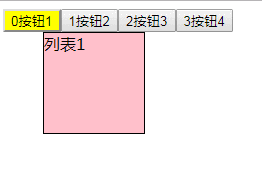
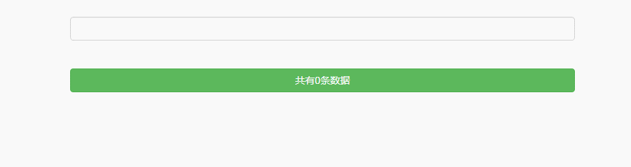

# 认识Vuejs

## 怎么学习

学习能力强的同学查看官方文档就可以学的很好，不过会感觉比较枯燥。所以我在安排这门课程时候，着重也是考量大家学习的情况，最终选择以案例的形式进行学习知识点。

当然，会有感觉，知识点比较碎。也正是因为这些碎点才让这门课更有意思。否则一直讲语法，我个人觉得同学们会睡着。

如果想要更详细的东西，建议直接看官方文档。

# 为什么学习Vuejs

我相信每个人学习Vue的目的是各不相同的。

可能你的公司正要将原有的项目使用Vue进行重构。

也可能是你的公司新项目决定使用Vue的技术栈。

当然，如果你现在正在换工作，你会发现招聘前端的需求中，10个有8个都对Vue有或多或少的要求。

当然，作为学习者我们知道Vuejs目前非常火，可以说是前端必备的一个技能。

## 招聘需求


## 简单认识一下Vuejs

**Vue (读音 /vjuː/，类似于 view)，不要读错。**

Vue是一个渐进式的框架，什么是渐进式的呢？

1. 渐进式意味着你可以将Vue作为你应用的一部分嵌入其中，带来更丰富的交互体验。
2. 或者如果你希望将更多的业务逻辑使用Vue实现，那么Vue的核心库以及其生态系统。
3. 比如Core+Vue-router+Vuex，也可以满足你各种各样的需求。

**Vue有很多特点和Web开发中常见的高级功能**

1. 解耦视图和数据
2. 可复用的组件
3. 前端路由技术
4. 状态管理
5. 虚拟DOM

这些特点，你不需要一个个去记住，我们在后面的学习和开发中都会慢慢体会到的，一些技术点我也会在后面进行讲解。

**学习Vuejs的前提？**

- 从零学习Vue开发，并不需要你具备其他类似于Angular、React，甚至是jQuery的经验。
- 但是你需要具备一定的HTML、CSS、JavaScript基础。

## Vuejs安装方式

> 使用一个框架，我们第一步要做什么呢？安装下载它
>
> 安装Vue的方式有很多：

**方式一：直接CDN引入(我们刚开始就用这个来去学习基础语法)**

你可以选择引入开发环境版本还是生产环境版本

```html
<!-- 开发环境版本，包含了有帮助的命令行警告 --> 
<script src="https://cdn.jsdelivr.net/npm/vue/dist/vue.js"></script>
<!-- 生产环境版本，优化了尺寸和速度 -->
<script src="https://cdn.jsdelivr.net/npm/vue"></script>
```

方式二：下载和引入

```html
开发环境 
https://vuejs.org/js/vue.js 
生产环境 
https://vuejs.org/js/vue.min.js
```

方式三：NPM安装

> 后续通过webpack和CLI的使用，我们使用该方式。

# Vue学习

## 前提对比jquery/js学习

**学习目标，我们学习Vue为了更好的体验，我们是对比着我们的jquery来进行学习。这样的话，既可以体会一下Vue的强大，又可以看出Vue和jquery的区别。**

# 初体验

## 需求

将js中的数据显示到html当中

## js版

```html
<div>
    <span id="box"></span>
</div>
<script>
	var str = "你好"
    var obox = document.getElementById('box');
    obox.innerHTML = str;
</script>
```

## Vue版

```html
<div id="app">
   <span>
    {{ str }}
   </span>
</div>
<script>
var vm = new Vue({
    el:"#app",
    data:{
        str:"你好"
    }
})
</script>
```

<http://jsrun.net/QbyKp>

在学习Vue版本时要注意，我们是先将data写好。el先不要去写。将数据直接通过 {{str}}的形式书写在模板上。然后去展示。

最后发现问题，数据没有显示到html中。那么和上面差了哪一步。其实我们只是定义了数据，没有将数据和html结合。我们可以通过el:"#app" 和html绑定关系 ，最终实现数据呈现。

综上我们可以发现我们将{{str}}放到哪个位置，哪个位置就可以显示数据。相比js而言。我们这里面就能够体会和js相比，我们可以通过{{}} 来实现将js中的数据显示到html中。

如下：

```html
<div id="app">
    {{ str }} {{ str }}
   <span>
    {{ str }}
   </span>
</div>
<script>
var vm = new Vue({
    el:"#app",
    data:{
        str:"你好"
    }
})
</script>
```

<http://jsrun.net/PbyKp>

## 总结：

从上面我们可以知道Vue是**声明式**数据的写法，而原生JS是**命令式**的写法。

## 体验增强

> data中的数据不仅仅是字符串，也可以是对象或者数组，现在我们先体验对象。

```html
<div  id="app">
    <span>姓名：{{ people.name }} 年龄：{{people.age}} 性别：{{people.sex}}</span>
</div>
<script>
  var vm = new Vue({
    el:'#app',
    data:{
      people:{
        name:'小伟',
        age:18,
        sex:'男'
      }
    }
  })
</script>
```

# 再体验

> 在输入框输入数据，会显示到span元素内部
>
> 也通过js和vue版去对比学习。

## js版

```html
<div>
    <input type="text" id="input">
    <span id="box"></span>
</div>
<script>
  var oinput = document.getElementById('input')
  var obox = document.getElementById('box');
  oinput.oninput = function () {
    obox.innerHTML = this.value;
  }
</script>
```

## Vue版

```html
<div id="app">
    <input type="text" v-model="str">
    <span>{{ str }}</span>
</div>
<script src="vue.js"></script>
<script>
  var vm = new Vue({
    el:'#app',
    data:{
      str:'你好'
    }
  })
</script>
```

> **这里面的v-model 其实就是专门 针对表单做的处理方式。**

# 注意事项

> el绑定的元素不可以是body或者html


# 插值深入学习

插值 ，其实就是{{}}语法，又称mustache语法[ˈmʌstæʃ]。本义 胡须。

插值语法，其实就是{{}}内部可以书写js的简单操作，其实也就是相当于js的表达式。加减乘除，数组操作，函数执行等。

## 简易购物车

> 简易购物车，这里面只是为了体验一下插值语法，
>
> 要注意，我们在进行加减乘除时候这里面的通过表单设置的数据都是字符串要乘以1，再进行加减乘除运算才好。
>
> 也可以通过其它方式。v-model.number强制修改成为数字。


```html
<link rel="stylesheet" href="bootstrap.min.css">

<div class="container" id="app">
    <div class="table">
        <table class="table">
            <thead>
                <tr>
                    <th>商品信息	</th>
                    <th>单价</th>
                    <th>数量</th>
                    <th>运费</th>
                    <th>金额</th>
                </tr>
            </thead>
            <tbody>
                <tr>
                    <td></td>
                    <td><input type="number" v-model="price"></td>
                    <td><input type="number" v-model="num"></td>
                    <td><input type="number" v-model="trans"></td>
                    <td>¥ {{ price*num + trans*1 }}</td>
                </tr>
            </tbody>
        </table>
    </div>
</div>
<script>
    var vm = new Vue({
        el:'#app',
        data:{
            price:15,
            num:1,
            trans:5
        }
    })
</script>
```

## 进阶(了解)

如果要纠结于这个结构不够完美，那么可以把表达式/插值语法改的更完美一些。后面会有更好的方法帮助我们去学习。

```
<td>¥ {{ price*num + (num*1>0?trans*1:0) }}</td>
```

# 体验指令（了解）

从上面我们可以发现当网页比较慢的时候，js还没有加载完时，会出现 一闪的情况。


## 解决办法01：

> 通过指令实现：指令是书写在html标签身上的功能。是Vue框架赋予了这个属性的一些功能。
>
> 特点：书写在标签属性上，当网络不友好时，也不显示其它字符，等全部加载完，再显示到页面中。

`v-html` 或者`v-text`

```html
<div id="app">
    <span v-text="str"></span>
</div>
<script src="vue.js"></script>
<script>
    var vm = new Vue({
        el:'#app',
        data:{
            str:'你好'
        }
    })
</script>
```

> 方法1固然好，不过也会带来麻烦 。因为我们在html标签的内容通过{{}}语法书写内容，非常灵活。而写在v-text内部会显得臃肿，而且效果还要进行字符串拼接。

如下：

```html
<div id="app">
    <span>{{str}}你好</span>
</div>
```

```html
<div id="app">
    <span v-text="str+'你好'"></span>
</div>
```

## 解决办法02：斗篷（隐身衣）

新方法v-cloak：

> 书写样式[v-cloak]可以让书写vue代码的部分全部隐藏。等Vue代码加载和编译完全，会让其显示出来。这样就不会有跳的感觉。

```html
<style>
    [v-cloak]{display: none;}
</style>
<div id="app" v-cloak>
    <span>{{str}}</span>
</div>
<script src="vue.js"></script>
<script>
    var vm = new Vue({
        el:'#app',
        data:{
            str:'你好'
        }
    })
</script>
```

# 元素切换显示


```html
<style>
    span{display: block;width: 200px; height: 200px;background: pink;}
</style>
<div id="app" >
    <button @click="toggle()">按钮</button>
    <span v-show="status"></span>
</div>
<script>
  var vm = new Vue({
    el: '#app',
    data: {
      status:false
    },
    methods:{
      toggle(){
        this.status = !this.status;
      }
    }
  })
</script>
```

## 功能分析

### v-show指令

首先v-show指令当值为true则为显示，值为false则为隐藏。

### 绑定事件

**分析**

**元素之所以可以显示原因是因为status的值为true。也就是说我们将这个数据改为false它就隐藏。我们操作button绑定的功能只要把status的值改变即可。**

> **直接将事件书写在模板中 v-on:click="指令名称()" 或者简写为 @click="指令名称()"**
>
> **指令名称对应的方法要号在js中的methods中，这里面写的方式是es6的简写方法，要和大家简单解释即可。**
>
> **在指令中想要访问data中的数据是通过  this 直接加上属性名称即可。如this.status.**
>
> 其中指令名称()的小括号 写不写都可以，不过要是传参的话，必须带小括号。后面会详细讲

```
data: {
	status:false
},
methods:{
    toggle(){
    this.status = !this.status;
}
```

# v-for指令

## 用 v-for 把一个数组对应为一组元素

我们用 `v-for` 指令根据一组数组的选项列表进行渲染。`v-for` 指令需要使用 `item in items` 形式的特殊语法，`items` 是源数据数组并且 `item` 是数组元素迭代的别名。

如果希望使用索引值那么提供了`(item,index) in items`第一项为数组元素的别名，第二项为索引值，不可以交换位置

```html
<div id="app">
    <ul>
        <li v-for="(people,index) in peoples">{{ index }}------ {{ people }}</li>
    </ul>
</div>
<script>
  var vm = new Vue({
    el: '#app',
    data: {
      peoples: ['小李', '小张', '小秦'],
    }
  })
</script>
```

## 一个对象的 v-for

你也可以用 v-for 通过一个对象的属性来迭代。

**value,key,index 第一个是对应的值，第二个是属性名称，第三个是索引。**

注意这里面的渲染的结果并不一定会按照对象的属性先后显示。

```
<div id="app">
    <p v-for="(value,key,index) in people">
        {{key}}---{{value}}
    </p>
</div>
<script>
  var vm = new Vue({
    el: '#app',
    data: {
      people: {
        name: "小李",
        age: 18,
        sex: "男"
      }
    }
  })
</script>
```

```
0--name---小李
1--age---18
2--sex---男
```

# v-bind:class

操作元素的类名或者内联样式，是一个常见的需求。可以结合表达式，进行字符串拼接即可，不过易出错。vue还提供我们可以通过v-bind处理class和style。可以是字符串，也可以是对象或者数组。

对象的形式会用的较多。其它形式可以参见官网文档自行学习即可（经过多年的实践很少用）

## vue-tab栏标签切换

```html
<style>
    button.active{
        background: yellow;}
    ul{ list-style: none;
        margin:0;}
    li{ margin:0;
        width: 100px;
        height: 100px;
        background: pink;
        border: 1px solid #000;
        display: none;}
    li.active{
        display: block;
    }
</style>
<div id="app">
    <button :class="{'active':index==sign}" @click="sign=index" v-for="(item,index) in btns">{{index}}按钮{{item}}</button>
    <ul>
        <li :class="{'active':index==sign}" v-for="(item,index) in lis">列表{{item}}</li>
    </ul>
</div>
<script>
     var vm = new Vue({
         el:"#app",
         data:{
             sign:0,
             btns:[1,2,3,4],
             lis:[1,2,3,4]
         }
     })
</script>
```




## 简易版todolist

> 用到了数组操作。数组追加push unshift  shift  pop   splice等。并且还用到了事件指令传参等功能。

```html
<div id="app" class="container">
    <input type="text" class="form-control" v-model="user" @keyup.enter="getUser()">
    <br>
    <ul class="list-group">
        <li class="list-group-item list-group-item-info" v-for="(item,index) in users">
            {{item}}
            <span class="close" @click="shan(index)">&times;</span>
        </li>
    </ul>
    <button class="btn btn-success btn-block">共有{{users.length}}条数据</button>
</div>
<script>
    new Vue({
        el:"#app",
        data:{
            users:[],
            user:""
        },
        methods:{
            getUser(){
                if(this.user.trim()!==""){
                    this.users.push(this.user);
                }
                this.user = "";
            },
            shan(index){
                this.users.splice(index,1);
            }
        }
    });
</script>
```



## vue-焦点图

> 这里面用到了**`v-bind:style`**属性，通过这个案例我们也可以学到关于**`生命周期`**的一点知识。

```html
<style>
*{
    padding: 0;
    margin: 0;
    list-style: none;
}
#app{
    width: 100%;
    overflow: hidden;
    position: relative;
}
ul{
    width: 500%;
    position: relative;
    left: 0;
    top: 0;
    transition: 1s;
}
ul li{
    width: 20%;
    float: left;
}
ul li img{
    width: 100%;
}
ol{
    position: absolute;
    left: 50%;
    margin-left: -60px;
    bottom: 20px;
}
ol li{
    width: 14px;
    height: 14px;
    background: #ccc;
    float: left;
    margin: 0 5px;
    cursor: pointer;
}
ol li.cur{
    background:#f10180;
}
.btn{
    position: absolute;
    width: 45px;
    height: 45px;
    cursor: pointer;
    top: 50%;
    margin-top: -22px;
}
.prev{
    left: 0;
    background:url("images/btn_l.png");
}
.next{
    right: 0;
    background:url("images/btn_r.png");
}
</style>
<div id="app" @mouseover="stop()" @mouseout="autoplay()">
    <ul :style="{'width':width,'left':left}">
        <li v-for="(item,index) in list" :style="{'width':liwidth}"></li>
    </ul>
    <ol>
        <li :class="{'cur':cur==index}" v-for="(item,index) in list" @click="change(index)"></li>
    </ol>
    <span class="btn prev" @click="less()"></span>
    <span class="btn next" @click="add()"></span>
</div>

<script>
    var vm = new Vue({
        el:"#app",
        data:{
            cur:0,
            list:["images/01.jpg","images/02.jpg","images/03.jpg","images/04.jpg","images/05.jpg","images/06.jpg"],
            timer:null
        },
        computed:{
            width:function(){
                return this.list.length*100+"%";
            },
            liwidth:function(){
                return 1/this.list.length*100+"%";
            },
            left:function(){
                return -this.cur*100+"%"
            }
        },
        methods:{

            add:function(){
                this.cur++;
                //if(this.cur>this.list.length-1){this.cur=0}
                //cur++，然后让新的cur等于加后的cur+个数/个数取余，其实刚好可以处理边界，省去判断
                this.cur = (this.cur+this.list.length)%this.list.length;
            },
            less:function(){
                this.cur--;
                //if(this.cur<0){this.cur=this.list.length-1}
                this.cur = (this.cur+this.list.length)%this.list.length;
            },
            change:function(index){
                this.cur = index;
            },
            autoplay:function(){
                var that = this;
                this.timer = setInterval(function(){
                    that.add();
                },2000);

            },
            stop:function(){
                clearInterval(this.timer);
            }
        },
        mounted:function(){
            this.autoplay();
        }
    });
</script>
```


# 事件修饰符

**事件修饰符这系列东西比较散碎，我们遇到什么再仔细说明即可。官网文档整理的比较细。我们在学习时候还是以能够明白而且应用为准。**

## 事件冒泡和阻止默认行为

```html
<style>
    #box1{
        width: 300px;
        height: 300px;
        background: pink;}
    #box2{
        width: 200px;
        height: 200px;
        background: skyblue;
    }
    #box3{
        width: 200px;
        height: 200px;
        background: skyblue;
    }
</style>
<div id="app">
    <div id="box1" @click="box1">
        box1
        <div id="box2" @click.stop="box2">
            box2
        </div>
    </div>
    <div id="box3" @contextmenu.prevent="box3">
        禁止鼠标右键
    </div>
</div>
<script>
    var vm = new Vue({
        el:'#app',
        methods:{
            box1(){
                alert(1)
            },
            box2(){
                alert(2)
            },
            box3(){
                alert(3)
            }
        }
    })
</script>
```


