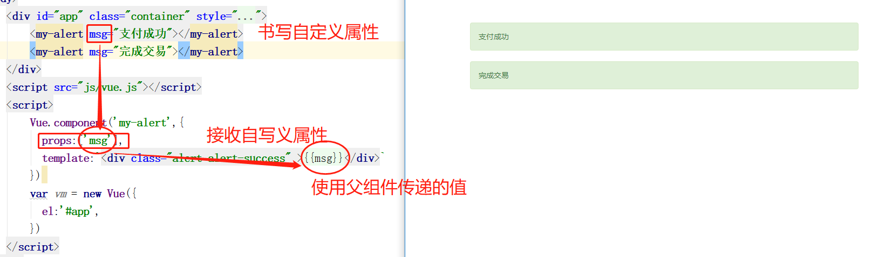

# 认识组件化

- 认识组件化
- 注册组件
- 组件其他补充
- 组件数据存放
- 父子组件通信
- 父级向子级传递
- 子级向父级传递
- 插槽slot

# 什么是组件化？（了解）

## 人面对复杂问题的处理方式：

> 任何一个人处理信息的逻辑能力都是有限的
>
> 所以，当面对一个非常复杂的问题时，我们不太可能一次性搞定一大堆的内容。
>
> 但是，我们人有一种天生的能力，就是将问题进行拆解。
>
> 如果将一个复杂的问题，拆分成很多个可以处理的小问题，再将其放在整体当中，你会发现大的问题也会迎刃而解。


## 组件化也是类似的思想：（了解/面试）

> 如果我们将一个页面中所有的处理逻辑全部放在一起，处理起来就会变得非常复杂，而且不利于后续的管理以及扩展。
>
> 但如果，我们讲一个页面拆分成一个个小的功能块，每个功能块完成属于自己这部分独立的功能，那么之后整个页面的管理和维护就变得非常容易了。
>


### 其它框架

> 组件化思想在很多其它ui相关的库中都有，只不过其它的UI库中的组件体积庞大，使用不方便，如jquery-ui，jquery-mobile等等。

### 组件化是Vue.js中的重要思想

- 它提供了一种抽象，让我们可以开发出一个个独立可复用的小组件来构造我们的应用。
- 任何的应用都会被抽象成一颗组件树。


### 组件化思想的应用：（了解/面试）

1. 有了组件化的思想，我们在之后的开发中就要充分的利用它。
2. 尽可能的将页面拆分成一个个小的、可复用的组件。
3. 这样让我们的代码更加方便组织和管理，并且扩展性也更强。

**所以，组件是Vue开发中，非常重要的一个篇章，要认真学习，不过也不用担心，我们后面讲的代码基本上都是由组件来维护起来的。**

# 模块化和组件化的区别

## 什么是组件:

组件的出现，就是为了拆分UI界面的功能，能够让我们以不同的组件，来划分不同的功能模块，将来我们需要什么样的功能，就可以去调用对应的组件即可

## 组件化和模块化的不同:

模块化:是从**代码逻辑的角度**进行划分的;方便代码分层开发，保证每个功能模块的职能单一

**组件化:是从UI界面的角度进行划分的前端的组件化方便组件的重用**

**举个更明显的例子：**

我们写一个导航组件，需要用到很多功能，中间的搜索功能，滚动后改变颜色。我们要是都写在这个组件里面导致代码量太多，维护成功较高。那么可以将其抽离成不同的模块。这样可以理解不？

# 注册组件

## 组件的使用分成两个步骤（掌握）

- 注册组件
- 使用组件

代码如下：

```html
<div id="app">
    <my-article></my-article>
</div>
<script src="js/vue.js"></script>
<script>
    Vue.component('my-article',{
        template:`<div>
                    <h3>这是标题</h3>
                    <p>段落</p>
    			</div>`
    })
    var vm = new Vue({
        el:"#app"
    })
</script>
```

如下图：


### 注意事项：

必须先注册才能使用。而且注册要写在实例之前。否则也不能生效。

## 组件名称大小写（掌握）

定义组件名的方式有两种：

### 使用 kebab-case(肉串/烤串)

```javascript
Vue.component('my-component-name', { /* ... */ })
```

当使用 kebab-case (短横线分隔命名) 定义一个组件时，你也必须在引用这个自定义元素时使用 kebab-case，例如 `<my-component-name>`。

### 使用 PascalCase(大驼峰)

```js
Vue.component('MyComponentName', { /* ... */ })
```

当使用 PascalCase (首字母大写命名) 定义一个组件时，你在引用这个自定义元素时两种命名法都可以使用。也就是说 `<my-component-name>` 和 `<MyComponentName>` 都是可接受的。注意，尽管如此，直接在 DOM (即非字符串的模板) 中使用时只有 kebab-case 是有效的。

## 局部注册（掌握）

我们之前 通过`Vue.component()`的方式注册组件，称之为全局注册，即在实例的任何地方都可以使用。

那么全局组件也会带来问题，比如将来我们在项目中注册过全局组件，但是我们后面不再使用它。那么会导致这个无用的全局组件也会被打包到项目中。我们可以通过局部注册的方式来解决这个问题，即需要的时候再来注册组件。

在这些情况下，你可以通过一个普通的 JavaScript 对象来定义组件：

```js
var ComponentA = { /* ... */ }
var ComponentB = { /* ... */ }
var ComponentC = { /* ... */ }
```

然后在 `components` 选项中定义你想要使用的组件：

```js
new Vue({
  el: '#app',
  components: {
    'component-a': ComponentA,
    'component-b': ComponentB
  }
})
```

## 组件模板抽离（了解掌握即可）

- 将模板写在注册组件的template属性上，这会让代码看起来非常难看，而且容易遮挡我们的视觉。
- 可以将它们单独拆分到template标签中，并且指定ID名称。在注册对应的template位置放上指定的ID名称即可。


# 案例（学习掌握）

## 结合bootstrap打造警示框组件


```html
<!DOCTYPE html>
<html >
<head>
    <meta charset="UTF-8">
    <title>03bootstrap警示框组件</title>
    <link rel="stylesheet" href="css/bootstrap.min.css">
</head>
<body>
    <div id="app" class="container" style="margin-top: 100px;">
        <my-alert></my-alert>
    </div>
    <script src="js/vue.js"></script>
    <script>
        Vue.component('my-alert',{
          template:`<div class="alert alert-success" role="alert">你好</div>`
        })
        var vm = new Vue({
          el:'#app',
        })
    </script>
</body>
</html>
```

# 组件通信-父向子传递数据

## 问题

可以发现组件内部的文本已经是具体的值。现在不可以进行传入变量。

而大部分情况下，我们是希望组件的文本或者其它信息会根据外部的变量进行变化。 

**其实就是希望父组件中的数据传入到子组件中。**

## 父向子传递数据

### 父组件是什么？子组件是什么？

我们称**创建组件即注册组件**为**子组件**

**使用组件即父组件**


## 父向子传（props）

### **自定义属性props**（数组方式/仅接收）

- 通过给父组件添加自定义属性
- 子组件中通过props接收父组件的自定义属性
- 在模板中通过{{自定义属性名称}}来显示数



```html
<div id="app" class="container" style="margin-top: 100px;">
    <my-alert msg="支付成功"></my-alert>
    <my-alert msg="完成交易"></my-alert>
</div>
<script src="js/vue.js"></script>
<script>
    Vue.component('my-alert',{
        props:['msg'],
        template:`<div class="alert alert-success" >{{msg}}</div>`
    })
    var vm = new Vue({
        el:'#app',
    })
</script>
```

### 自定义属性props（对象方式/验证）

> 上面书写的数组方式，我们可以发现一下，不利于团队协作开发。
>
> 如果工作中我们希望团队协作开发，那么我们的**msg如果期望的是只能传字符串**，而用户是不确定的，可以给你写一个**数组**等等，显然是错误的。如下图，也不报错，也不提示，这显然是不正确的。

#### props数据验证

支持String、Number、Boolean、Array、Object、Date、Function、Symbol


**那么就需要我们使用对象的方式来进行验证规则**

如下图，有三种方式：

一般来讲required和default这两个值只允许存在一个。


注意首字母要大写，且不加引号

### 组件扩展-组件循环

1. 对上面的组件我们可以发现，父组件书写了两个，其实本质上还是没有达到化简的效果？
2. 如果有100个呢？我们还这么书写那不是会导致不停的复制粘贴修改吗？
3. 如果后期改变数量变为50个我们不还得修改结构吗？

肯定有同学会想到v-for循环。那么我们可以将msg对应的值存放到实例中。


```html
<div id="app" class="container" style="margin-top: 100px;">
    <my-alert v-bind:msg="item" v-for="(item,index) in msgarr"></my-alert>
</div>
<script src="js/vue.js"></script>
<script>
    Vue.component('my-alert',{
        props:['msg'],
        template:`<div class="alert alert-success" >{{msg}}</div>`
    })
    var vm = new Vue({
        el:'#app',
        data:{
            msgarr:['支付成功','完成交易']
        }
    })
</script>
```

# 组件通信-子向父传递数据

## 单向数据流

首先我们要明白，子向父传递数据是单向数据流。默认的父向子传递数据是通过属性向下传递。但是在子组件中不可以对数据做任何的更改。更改是错误的，不会影响到父组件的数据变化。

需要借助工具将其改变。

**举个栗子**

水往低处流，就相当于单向数据流，只能朝一个方向流动。如果希望往上流的话，我们可以借助人力或者机械这种工具来改变。那么这个工具对应的vue内部我们称之为自定义事件。

我们书写单击按钮让p标签隐藏的效果，发现无效，而且还报错。提示也是同样的，不可以对属性进行更新。所以我们要借助于自定义事件来解决。

如下图：


## jquery自定义事件

### 需求：我们给每个按钮绑定不同的功能。

其中，我们按下a按钮除了要执行自己的功能还要执行 另外两外按钮的功能。我们可以通过trigger来将其对应的事件进行触发。

那么可以发现我们给每一个div都绑定了自己的事件。这个事件是自已定义的名称，通过trigger来进行将其触发掉。

### 那么我们来分析一下为什么要做这么一项工作。

我们完全可以将操作三个div的功能写在，操作按钮对应的指令中。但是我们没有这么做。

我们可以考虑一下在工作中如果单击按钮要做的功能特别复杂，那么对应的代码全写在这里面。会导致我们的代码杂乱无章。将来不利于维护代码

如果我们将每个元素自己相应的功能拆分，这样的话我们在主业务中的代码会非常清晰。如下图你会觉得我们的代码，各斯其职，不仅写起来简单，而且维护起来也方便。


## vue中的自定义事件

1.在父组件上指定**自定义事件并且指定函数名称**。注意绑定事件对应的**函数名称不可以加括号**


2.指定的函数名称书写在对应的组件环境的methods下。并且定义该功能时，一般都要传参。


3.在子组件中正常绑定事件。并且在当前组件环境的methods下定义该功能change。


4.对应的功能如何才能将父组件中的自定义事件对应的函数功能触发，通过**this.$emit('自定义事件名称',参数)**


## 组件的私有数据（data）

实例有数据，组件也有自己的数据，那么这个数据是写在data中的。不过和实例中的有一些区别，这个对象需要是一个函数，返回一个对象，这个对象里面才可以写私有数据。

**书写数器案例**


```html
<!DOCTYPE html>
<html lang="en">
<head>
    <meta charset="UTF-8">
    <title>Title</title>
    <link rel="stylesheet" href="css/bootstrap.min.css">
    <style>
        .container {
            margin-top: 100px;
        }
    </style>
</head>
<body>
<div class="container" id="app">
    <h2>{{total}}</h2>
    <child @increment="changeTotal" @decrement="changeTotal"></child>
</div>
<template id="childCom">
    <div>
        <button @click="increment">+1</button>
        <button @click="decrement">-1</button>
    </div>
</template>
<script src="js/vue.js"></script>
<script>
  Vue.component('child', {
    data() {
      return {
        num: 0
      }
    },
    template: '#childCom',
    methods: {
      increment() {
        this.num++;
        this.$emit('increment', this.num)
      },
      decrement() {
        this.num--;
        this.$emit('decrement', this.num)
      }
    }
  })
  var vm = new Vue({
    el: '#app',
    data: {
      total: 0
    },
    methods: {
      changeTotal(val) {
        this.total = val;
      }
    }
  })
</script>
</body>
</html>
```


## 总结

### 什么时候需要自定义事件呢？

当子组件需要向父组件传递数据时，就要用到自定义事件了。

我们之前学习的v-on不仅仅可以用于监听DOM事件，也可以用于组件间的自定义事件。

### 自定义事件的流程：

在子组件中，通过$emit()来触发事件。

在父组件中，通过v-on来监听子组件事件。

### 我们来看一个简单的例子：

我们之前做过一个两个按钮+1和-1，点击后修改counter。

我们整个操作的过程还是在子组件中完成，但是之后的展示交给父组件。

这样，我们就需要将子组件中的counter，传给父组件的某个属性，比如total。

### 组件的数据来源（先了解，通过项目再了解）

props父组件传递下来（一般是需要从父组件改变后，子组件也要跟着发生相应的改变）

data中的数据当前组件的私有数据（当前组件内部独享的数据）


## 案例

简易版todolist-组件改版（学习和掌握）

```html
<div class="container" id="box">
    <!--非父子间通信-->
    <form-control @paradd="increment"></form-control>
    <ul class="list-group">
        <list-item @parremove="remove" v-for="(item,index) in list" :key="item" :item="item" :index="index" ></list-item>
    </ul>
    <button class="btn btn-block btn-danger">总计：现在有{{ list.length }}条数据</button>
</div>
<script src="js/vue.js"></script>
<script>
  Vue.component('FormControl',{
    data(){
      return {
        user:''
      }
    },
    template:`<input type="text" v-model.trim="user" class="form-control" @keyup.enter="add()" >`,
    methods:{
      add(){
        if(this.user==''){
          alert('请你输入内容好吗')
          return;
        }
        this.$emit('paradd',this.user);
        this.user = '';
      }
    }
  })
  Vue.component('ListItem',{
    props:['item','index'],
    template:`<li class="list-group-item list-group-item-success">
                    {{item}}
                    <span class="close" @click="remove(index)">&times;</span>
                </li>`,
    methods:{
      remove(index){
        this.$emit('parremove',index)
      }
    }
  })
  var vm = new Vue({
    el:"#box",
    data:{
      user:'',
      list:[]
    },
    methods:{
      increment(txt){
        this.list.unshift(txt);
      },
      remove(index){
        this.list.splice(index,1)
      }
    }
  })
</script>
```

# 组件间访问（了解）

指定已创建的实例之父实例，在两者之间建立父子关系。子实例可以用 `this.$parent` 访问父实例，子实例被推入父实例的 `$children` 数组中。

该作用通过案例讲解即可。

## 注意

> 节制地使用 `$parent` 和 `$children` - 它们的主要目的是作为访问组件的应急方法。更推荐用 props 和 events 实现父子组件通信

## 父组件访问子组件两种方式

`$children`和`$refs` 这两种方式推荐用后者。

## 子组件访问父组件

`$parent`

## 访问根组件

`$root`


