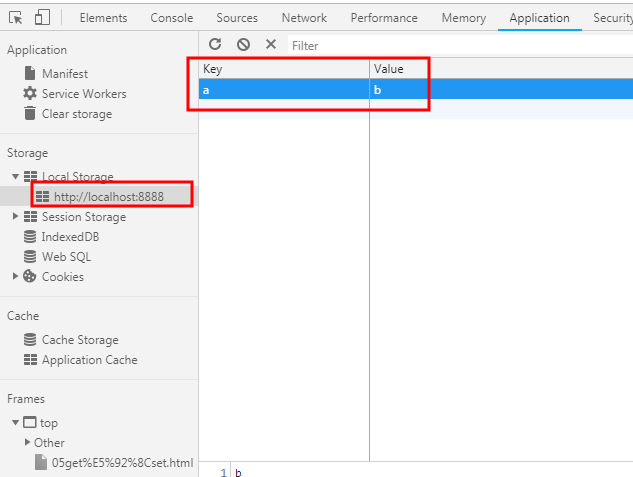
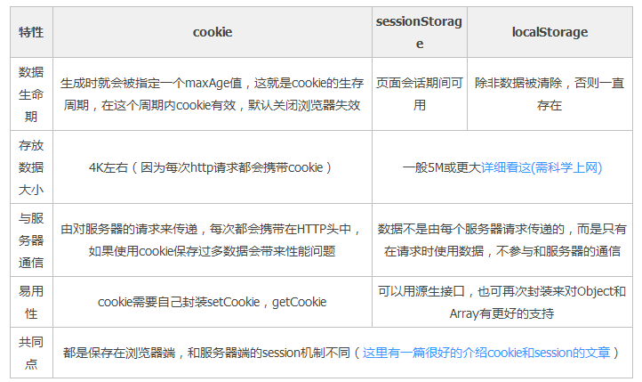
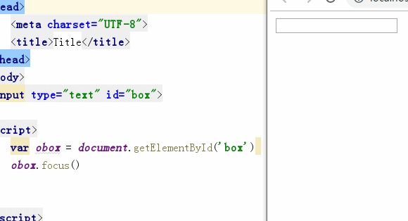
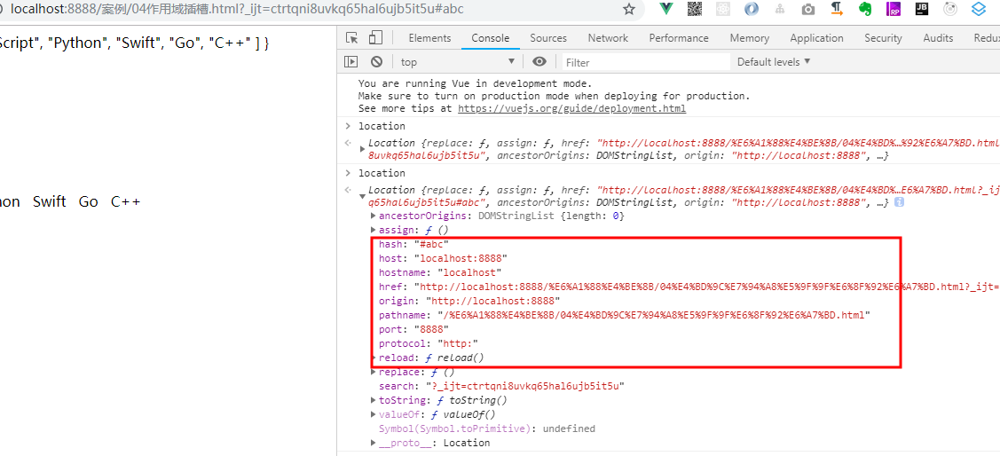
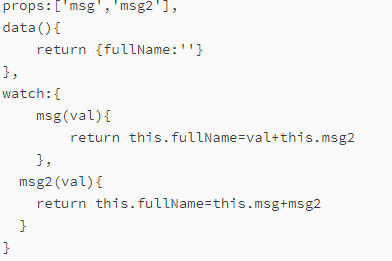
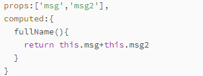

# Vue语法高级扩展

watch及computed这两个不太好懂，我们通过一个todolist来学习一下。同样的在学习过程中，我们会遇到一些JS的语法。我们事先对其有个了解。

# 本地存储

## localStorage永久存储

方法：

localStorage.setItem('a','b') 



获取数据

localStorage.getItem('a')

## sessionStorage 临时会话存储

浏览器关闭即消失，一般用来存储用户的信息。关掉浏览器后，需要重新登录

用法同上。



# 表单聚焦

默认打开浏览器，鼠标光标就聚集在表单中



# 数组其它方法

forEach、map、filter、reducer（很强）

```
var  arr  = [1,2,3,4];
    // arr.forEach(function (item,index) {
    //     console.log(item,index)
    // })
    // var newarr = arr.map(function(item,index){
    //     console.log(item)
    //     return item+1;
    // })
    // console.log(arr,newarr)
    // var newarr  = arr.filter(function(item,index){
    //     if(item>2){
    //         return item;
    //     }
    // })
    // console.log(arr,newarr)

    //reduce很强
    // var num = arr.reduce(function(a,b){
    //     return a+b
    // },0)
    // console.log(num)
```

# hash路由跳转及检测

location.hash、location.href、host、hostname、origin、pathname、protocol及所有的系列



```
<a href="#box1">跳</a>
<a href="#box2">跳</a>
<br><br><br><br><br><br><br><br><br><br><br><br><br><br><br><br><br><br><br><br><br><br><br><br><br><br><br><br><br><br><br><br><br><br><br><br><br><br><br><br><br><br><br><br><br><br><br><br><br><br><br><br><br><br><br><br><br><br><br><br><br><br><br><br><br><br><br><br><br><br><br><br><br><br><br><br><br><br><br><br><br><br><br><br><br><br><br><br><br><br><br><br><br><br><br><br><br><br><br><br>

<script>
    // hash不会引起浏览器发生跳转
    //路由就是管理浏览器链接的   可以通过hash来进行管理路由
    window.onhashchange = function(){
        console.log(location.hash)
    }
</script>
```

# 数据劫持

数据劫持其实就是Object.defineProperty这个功能

```js
var obj = {
        a:1,
        b:2
    };
    Object.keys(obj).forEach(key=>{
        jiechi(obj,key,obj[key]);
    })
function jiechi(obj,key,value){
    Object.defineProperty(obj,key,{
        enumerable:true,//可以被for循环便利出来
        configurable:true,//可以被删除，可以被修改 如果为 false , 那么不可以修改, 不可以删除.
        get(){//获取值
            //处理功能
            return value+10;
        },
        set(newVal){//修改值
            //处理功能
            value = newVal;
        }
    })
}
```

# TODOLIST完整版

设计到知识点为watch和computed。computed其实就是上面的数据劫持中的get和set

这里要着重讲解一下数据劫持。其实VUE内部原理就是数据劫持。当数据发生改变去更新HTML。

这里面会遇到一点正则，可以换成其它方法split();

## watch其实就是检测数据发生改变。

​	一般是用来检测data中已经存在的数据。

   一个值可以修改data中的多个值

> msg和msg2已经是在props中存在数据。检测msg和msg2可以去修改data中存在的数据。



## computed

​	既可以检测数据变化，也可以创造数据

   data/props中的多个值，来决定当前值的结果

> data和props中没有fullname这个属性，通过computed计算后会多一个fullName属性



```
<!DOCTYPE html>
<html>

<head>
    <meta charset="UTF-8">
    <title></title>
    <link rel="stylesheet" href="css/todo_base.css">
    <link rel="stylesheet" href="css/todo_index.css">
</head>

<body class="learn-bar">
<section id="todoapp">
    <header id="header">
        <h1>todos</h1>
        <input v-model.trim="myinput"  id="new-todo" placeholder="来添加一些大事件?" autofocus="autofocus" @keyup.enter="add()">
    </header>
    <section id="main">
        <input id="toggle-all"  type="checkbox" v-model="toggle">
        <label for="toggle-all">选中全部</label>
        <ul id="todo-list">
            <li :class="{completed:item.selected,editing:index==edit}"  v-for="(item,index) in curList" :key="item.title">
                <div class="view">
                    <input  type="checkbox" class="toggle" v-model.trim="item.selected">
                    <label @dblclick="edit = index">{{item.title}}</label>
                    <button class="destroy" @click="list.splice(index,1)"></button>
                </div>
                <input  class="edit"  v-focus="edit==index"   v-model.trim="item.title" @blur="edit = -1"    @keyup.enter="edit=-1"  >
            </li>
        </ul>
    </section>
    <footer id="footer" v-show="list.length"><span id="todo-count"><strong>{{left}}</strong>进行中</span>
        <ul id="filters">
            <li>
                <a href="#/all" :class="{selected:sign=='all'}">全部</a>
            </li>
            <li>
                <a href="#/activing" :class="{selected:sign=='activing'}" >进行中</a>
            </li>
            <li>
                <a href="#/completed" :class="{selected:sign=='completed'}" >已完成</a>
            </li>
        </ul>
        <button id="clear-completed" style="" v-show="list.length-left" @click="remove()" >删除完成</button>
    </footer>
</section>
<script src="js/vue.js"></script>
<script>
    //定义三个函数
    var filter = {
        all(data){
            return data;
        },
        activing(data){
            return data.filter(function(item){
                return item.selected == false;
            })
            //return data.filter(item=>item.selected==false);
            // return data.filter((item,index) => {
            //     console.log(index)
            //    return  item.selected==false
            // })
        },
        completed(data){
            return data.filter(function(item){
                return item.selected == true;
            })
        }
    }


    Vue.directive('focus',{
        update(el,binding){
            if (binding.value) {
                //el就是原生的dom对象。binding指的就是指令里面传递的值v-focus="值"
                el.focus()
            }
        }
    })
    var local = {
        //获取本地存储数据
        get(){
            //JSON.parse 是为将存储的数据（字符串型） 转成对象 如果一开始没有数据默认就是一个空对象，所以要加上或[]
            return JSON.parse(localStorage.getItem('VUE619')) || []
        },
        //设置本地存储数据
        set(value){
            localStorage.setItem('VUE619',JSON.stringify(value))
        }
    }

    var vm = new Vue({
        el: '#todoapp',
        data: {
            sign:'all',
            edit: -1,
            myinput: '',
            list: local.get(),
            curList:[]
        },
        computed:{
            left(){
                return filter.activing(this.list).length
            },
            toggle:{
                get(){
                    return this.left == 0;
                },
                set(val){
                    this.list.forEach(function(item){
                        item.selected  = val;
                    })
                }
            }
        },
        watch: {
            //浅观测 只能够看到第一级对象里面数据的变化
            // list(){
            //     local.set(this.list)
            // }
            list:{
                handler(){
                    local.set(this.list)
                },
                //深观测
                deep: true
            }
        },
        methods: {
            remove(){
                this.list =  filter.activing(this.list);
                this.curList = this.list;
            },
            add(){
                if (this.myinput == '' ) {
                    return;
                }
                this.list.push({selected: false,title: this.myinput})
                this.myinput = '';
            },
            change(sign){
                this.sign = sign;
                this.curList = filter[sign](this.list);
            }
        },
        mounted(){
            this.curList = this.list;
        }
    })
    //VUE路由的简单写法。
    window.onhashchange = function(){
        var hash = location.hash.replace(/^#\//g,'')
        vm.change(hash)
    }

</script>


</body>

</html>
```


