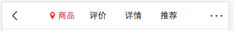

# 组件化高级

## 复习组件化知识

组件化，组件化和模块化的区别，注册组件，父子通信，props传递数据（静态/动态）及验证

# 为什么使用插槽

## 插槽

在生活中很多地方都有插槽，电脑的USB插槽，插板当中的电源插槽。
插槽的目的是让我们原来的设备具备更多的扩展性。
比如电脑的USB我们可以插入U盘、硬盘、手机、音响、键盘、鼠标等等。

## 组件的插槽

组件的插槽也是为了让我们封装的组件更加具有扩展性。
让使用者可以决定组件内部的一些内容到底展示什么。

## 举例：移动网站中的导航栏。

移动开发中，几乎每个页面都有导航栏。
导航栏我们必然会封装成一个插件，比如nav-bar组件。
一旦有了这个组件，我们就可以在多个页面中复用了。

**但是，每个页面的导航是一样的吗？No，我以京东M站为例**

如下图:





# 如何封装这类组件呢？slot

## 如何去封装这类的组件呢？

它们也很多区别，但是也有很多共性。
如果，我们每一个单独去封装一个组件，显然不合适：比如每个页面都返回，这部分内容我们就要重复去封装。
但是，如果我们封装成一个，好像也不合理：有些左侧是菜单，有些是返回，有些中间是搜索，有些是文字，等等。

## 如何封装合适呢？抽取共性，保留不同。

最好的封装方式就是将共性抽取到组件中，将不同暴露为插槽。
一旦我们预留了插槽，就可以让使用者根据自己的需求，决定插槽中插入什么内容。
是搜索框，还是文字，还是菜单。由调用者自己来决定。

**这就是为什么我们要学习组件中的插槽slot的原因。**


# slot基本使用

## 如何使用slot？

在子组件中，使用特殊的元素<slot>就可以为子组件开启一个插槽。
该插槽插入什么内容取决于父组件如何使用。

## 举例:

### 简单示范

<slot>中的内容表示，如果没有在该组件中插入任何其他内容，就默认显示该内容
有了这个插槽后，父组件如何使用呢？

```html
 <div id="app">
     <my-com></my-com>
     <my-com>
         <h2>这是替换插槽的标题</h2>
         <p>这是替换插槽的段落</p>
     </my-com>
</div>
<template id="myCom">
    <div>
        <slot>我是一个插槽中的默认内容</slot>
    </div>
</template>
```


## 具名插槽

## 当子组件的功能复杂时，子组件的插槽可能并非是一个。

- 比如我们封装一个导航栏的子组件，可能就需要三个插槽，分别代表左边、中间、右边。
- 那么，外面在给插槽插入内容时，如何区分插入的是哪一个呢？
- 这个时候，我们就需要给插槽起一个名字

## 如何使用具名插槽呢？

非常简单，只要给slot元素一个name属性即可`<slot name='myslot'></slot>`

## 案例

这里我们先不对导航组件做非常复杂的封装，先了解具名插槽的用法。


```html
<div id="app">
    <my-com></my-com>
    <hr>
    <my-com>
        <span slot="center">叩丁狼</span>
    </my-com>
    <hr>
    <my-com>
        <span slot="left">返回</span>
        <span slot="center">叩丁狼</span>
        <span slot="left">菜单</span>
    </my-com>
</div>
<template id="myCom">
    <div>
        <slot name="left">默认左侧</slot>
        <slot name="center">默认中间</slot>
        <slot name="right">默认右侧</slot>
    </div>
</template>
```

# 编译作用域

## 概念编译作用域。

官方对于编译的作用域解析比较简单，我们自己来通过一个例子来理解这个概念：
我们来考虑下面的代码是否最终是可以渲染出来的：

`<my-cpn v-show="isShow"></my-cpn>`中，我们使用了isShow属性。
isShow属性包含在组件中，也包含在Vue实例中。

答案：最终可以渲染出来，也就是使用的是Vue实例的属性。

## 为什么呢？

官方给出了一条准则：**父组件模板的所有东西都会在父级作用域内编译；子组件模板的所有东西都会在子级作用域内编译。**
而我们在使用`<my-cpn v-show="isShow"></my-cpn>`的时候，整个组件的使用过程是相当于在父组件中出现的。
那么他的作用域就是父组件，使用的属性也是属于父组件的属性。
因此，isShow使用的是Vue实例中的属性，而不是子组件的属性。


# 作用域插槽：准备

> 我们现在讲解的版本是2.5版本而并非是最新的Vue版本.在这里面最新的2.6版本处理方式是不同的.因为我们是有很多年的开发经验 所以一定要学习2.5版本.后期我们去查看一下再使用2.6版本.

## 作用域插槽(较麻烦)

> 是slot一个比较难理解的点，而且官方文档说的又有点不清晰。
>
> 这里，我们用一句话对其做一个总结，然后我们在后续的案例中来体会：
> **父组件替换插槽的标签，但是内容由子组件来提供。**


## 我们先提一个需求：

**子组件中包括一组数据**，比如：`languages: ['JavaScript', 'Python', 'Swift', 'Go', 'C++'] `需要在多个界面进行展示：

- **某些界面是以水平方向一一展示的，**
- **某些界面是以列表形式展示的，**
- **某些界面直接展示一个数组**

**但是这个数组是存在于子组件中，希望父组件告诉我们如何展示，怎么办呢？**

## 利用slot作用域插槽就可以了

我们来看看子组件的定义：

1. 我们通过`<template slot-scope="slotProps">`获取到slotProps属性
2. 在通过slotProps.data就可以获取到刚才我们传入的data了


```html
<!DOCTYPE html>
<html>
<head>
    <meta charset="UTF-8">
    <title>Title</title>
</head>
<body>
<div id="app">
    <!--列表形式展示-->
    <my-com>
        <template  slot-scope="abc" slot="left">
            {{abc}}
            <ul>
                <li v-for="(item,index) in abc.data">{{item}}</li>
            </ul>
        </template>
    </my-com>
    <!--水平展示-->
    <my-com>
        <template slot-scope="abc" slot="left">
            <span v-for="item in abc.data">{{item}}&nbsp;&nbsp;&nbsp;</span>
        </template>
    </my-com>
</div>
<template id="myCom">
    <div>
        <slot :data="language" name="left"></slot>
        <slot name="right"><div>123</div></slot>
    </div>
</template>
<script src="js/vue.js"></script>
<script>
    Vue.component('my-com',{
        template:'#myCom',
        data(){
            return {
                language:['JavaScript', 'Python', 'Swift', 'Go', 'C++']
            }
        }
    });
    var vm = new Vue({
        el:'#app',
    });
</script>
</body>
</html>
```


# 作业

## 01实现京东头部组件(插槽):


[TOC]

