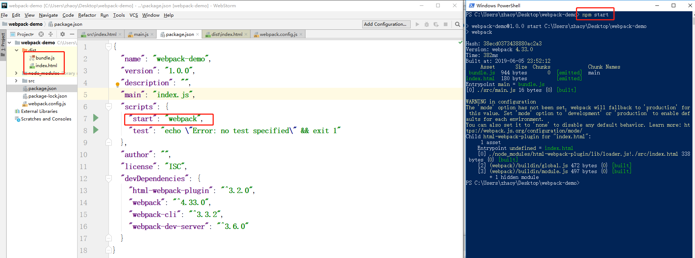
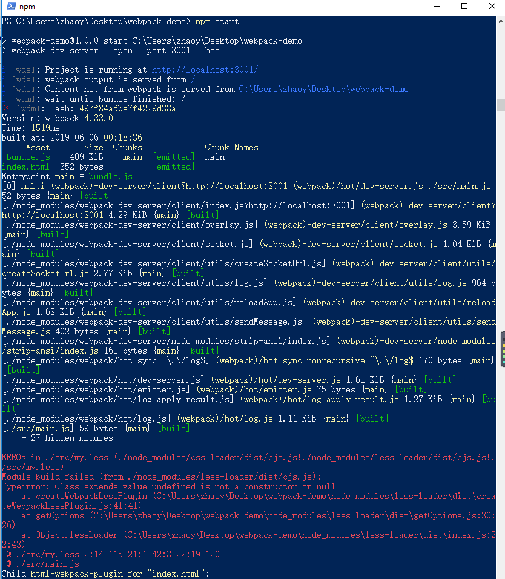
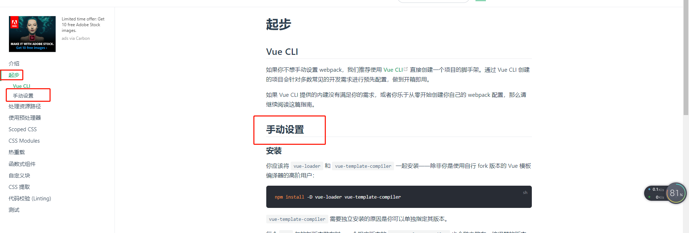

# Webpack 4.0

## 什么是webpack?

在了解webpack我们首先要知道它是干什么的，它称之为前端工程化管理工具。

## 什么是自动化构建工具？

自动构建工具就是一种：**用来让我们不再做机械重复的事情，解放我们的双手的工具**

> 举个例子：
>
> 比如你很喜欢**ES6，TypeScript ， SASS  或者 Less** 等来做项目，但是浏览器对这些语法的支持不友好或者甚至不支持该语法。
>
> 这时可能你会借助**Babel**工具手动将**ES6转成ES5** , 会借助微软的**TypeScript 编译器**来编译**TypeScript** ，会借助**SCSS编译**工具来编译**SCSS** ....   虽然这样你可以把问题解决了，但是这样有一个不好的地方就是，每修改一次代码都要将这些东西手动编译一次，非常麻烦。那么有没有什么能够帮助我们不再做机械重复的事情，解放我们的双手的工具？答案是肯定的，自动化构建工具这个时候就派上用场了。


构建工具就是做这件事，将源代码转换成可以执行的JavaScript、CSS、HTML 代码，包括如下内容：

- 代码转换：将 TypeScript 编译成JavaScript、将 SCSS 编译成 CSS等。
- 文件优化：压缩JavaScript、CSS、HTML 代码，压缩合并图片等。
- 代码分割：提取多个页面的公共代码，提取首屏不需要执行部分代码让其异步加载。
- 模块合并：在采用模块化的项目里会有很多个模块和文件，需要通过构建功能将模块分类合并成一个文件。
- 自动刷新：监听本地源代码变化，自动重新构建、刷新浏览器。
- 代码校验：在代码被提交到仓库前需要校验代码是否符合规范，以及单元测试是否通过。
- 自动发布：更新代码后，自动构建出线上发布代码并传输给发布系统。

构建其实是工程化、自动化思想在前端开发中的体现，将一系列流程用代码去实现，让代码自动化地执行这一系列复杂的流程。构建为前端开发注入了更大的活力，解放了我们的生产力。


## Webpack核心概念

> 模块和打包
>
> 在webpack中，所有的静态资源都可以被处理为一个模块，包括js、图片、css、字体。


## 概念和配置

webpack中最重要的概念有以下几个：

- Entry, 工程的入口文件配置
- Output, 打包的输出的文件配置
- Loaders, 加载器，用于处理各种不同类型的模块，可扩展
- Plugins, 插件，在webpack打包过程中不同时机执行一些任务，比如清除打包目录、复制静态文件、抽取css文件
- Mode, 区分开发环境和生成环境

webpack一般根据配置文件去执行打包任务，我们创建一个webpack.config.js文件来编写我们的打包配置。

## 安装

> webpack4和webpack3的一些区别命令行区别及优化打包方面（打包生产环境配置）改变比较大。重点讲解webpack4的本地开发环境，webpack3的配置本地开发环境 是一样的。

webpack4 的安装必须安装webpack-cli，那我们就安装一下

### 全局安装

`npm install webpack webpack-cli -g`

### 本地安装

`npm init -y` 初始化项目

`npm install webpack webpack-cli -D` 安装webpack

## 命令行使用

webpack 本地文件 --output 目录地址文件` 

`webpack src/main.js --output dist/bundle.js` 

其中--output 可以简写为-o;

## 配置文件

我们可以发现每次去写命令行比较麻烦

### 1.项目的根目录手动创建 `webpack.config.js`文件**。

对应上面的命令我们可以书写以下的代码

```js
// webpack.config.js
const path = require('path');
module.exports = {
  entry:path.join(__dirname,'./src/main.js'),
  output: {
    path: path.join(__dirname,'./dist'),
    filename: "bundle.js"
  },
}
```

注意：`webpack.config.js`只支持 `common.js`语法。所以我看过去用`module.exports`导出

### 2.第一种执行`webpack.config.js`

通过命令行`webpack`运行，那么会在项目目录 中创建一个dist的目录，内部会有bundle.js

```
node_modules
dist-|
	 |-bundle.js
src-—|
	 |-index.html
	 |-main.js
package.json
webpack.config.js
```


### 3.第二种执行**package.json**配置**scripts**执行脚本

```json
"scripts": {
  "start": "webpack"
},
```

这里我在scripts下定义了一个键为start。 可以通过**`npm start`** 来执行对应的 webpack命令。

### 4.修改html文件的引入

我们要手动把`dist/bundle.js`添加到html文件中

`<script src="../dist/bundle.js"></script>`

# 自动引入js文件

`html-webpack-plugin`上面的效果我们需要手动去引入。这样不是我们的风格，我们需要工程化，所以我们可以通过`webpack`提供的`plugin`机制来实现

## 1.下载

`npm install html-webpack-plugin`

## 2.使用

**在webpack.config.js中引入**

`const HtmlWebpackPlugin = require('html-webpack-plugin')` 

## 3.配置

当前配置中其实是将src中的index进行拷贝一份，打包到dist目录并且将打包后的bundle.js自动插入到html文件中。

```js
plugins:[
	new HtmlWebpackPlugin({
		template:path.join(__dirname,'./src/index.html')，
		filename:'index.html'
	})
]
```

## 4.重启命令

`npm start`



执行完以后会在dist目录中输入两个文件,且dist目录的效果就是我们打包后的东西。

```
node_modules
dist-|
	 |-bundle.js
	 |-index.html
src-—|
	 |-index.html
	 |-main.js
package.json
webpack.config.js
```

# 热更新服务webpack-dev-server

我们在修改main.js中的代码会发现不会做任何的更改，所以我们需要webpack-dev-server去帮助我们去实现修改代码后按`ctrl+s`自动更新的效果

修改`package.json`中的`scripts`配置

```
"scripts": {
    "start": "webpack-dev-server --open --port 3000 --hot"
  },
```

`webpack-dev-server` 会启动当前项目`devDependencies`中的`webpack-dev-server`依赖,

`--open` 写全一些是`--open true` 自动打开浏览器

`--port 3000` 打开服务的端口号为3000

`--hot true`监听代码修改自动刷新浏览器

> 注意index.html中的变化默认是不会监听的。后期我们会知道为什么不会被监听。即使被监听也没有什么意义

至此我们的基本服务已经搭建完成


# Loader

loader其实就是对各种文件进行正确的解析和打包，正常情况下会将所有的文件进行打包，到bundle.js中。

不同的文件需要不同的loader进行解析成为webpack的模块，这样的话webpack才可以认识，否则就是错误 的文件。

## 使用CSS、less、及图片

> 我们在main.js中导入css文件，会发现根本不会运行,竟然还会报错。


# CSS文件处理

对于css文件来说，我们需要安装两个loader 一个是`css-loader`正确的将其认识为模块，

另一个就是`style-loader`，将解析的样式，显示到html中，就是插入style标签。

## 我们先安装css-loader，再执行npm start

`npm install css-loader -D`

修改webpack.config.js

```js
module: {
  rules: [
    {test:/\.css/,use:['css-loader']}
  ]
}
```

`npm start`


## 查看bundle.js

> 打开localhost:3001/bundle.js其实就是内存中的bundle.js。我们要注意我们通过webpack-dev-server执行后。默认的文件都会存在内存中。而不会去更新我们的dist目录 
>
> 我们进行搜索可以发现确实已经将颜色值gold放入我们的bundle.js文件中。


## style-loader

但是页面没有任何的效果。可以仔细审查元素，发现我们的样式根本 没有显示到html中。所以我们需要style-loader帮助我们解决问题


## 安装style-loader

`npm install style-loader -D`

修改webpack.config.js

```js
module: {
  rules: [
    {test:/\.css/,use:['style-loader','css-loader']}
  ]
}
```


注意loader的执行顺序是从右向左执行的。所以从右往左依次是先加载 css-loader 再通过style-loader放入到html中。`use:['style-loader','css-loader']`

# 配置less预处理器

## 1.新建`my.less`样式如下

```less
body{
  background: pink;
  ul{
    background: skyblue;
  }
}
```

## 2.引入到main.js中

`import './my.less'`


## 3.配置`webpack.confog.js` 的`loader`

`npm install less-loader -D`

且设置loader如下

```js
 module: {
    rules: [
      {test:/\.css/,use:['style-loader','css-loader']},
      {test:/\.less/,use:['style-loader','css-loader','less-loader']}
    ]
  }
```

会报错



## 4.安装less

**原因是less-loader是加载less文件，加载后需要依赖less的lessc命令把它编译成css文件，再通过css-loader加载到js中。再通过style-loader把它放到html中的style标签内部**

`npm install less -D`


# ES6、ES7转ES5

为了让浏览器支持我们写的js代码。默认有的代码是在其它浏览器不兼容，我们可以通过`babel`进行将代码编译成为浏览器可以执行的代码。

我们需要对我们自己写的js代码进行编译。也需要babel-loader进行编译。不过在这里面我们需要打开webpack的官方文档去查找babel-loader进行相应的安装。

## 安装

<https://webpack.js.org/loaders/babel-loader#install>

官方建议用这个，但是千万不要用它。会出错

`npm install -D babel-loader @babel/core @babel/preset-env  @babel/plugin-transform-runtime`

请使用

`npm install -D babel-loader^7.1.5 babel-core  babel-plugin-transform-runtime  babel-preset-env babel-preset-stage-0`

**注意babel-loader 默认安装的是8的版本。我们需要7即可。上面的官方推荐，是有问题的，后面我们就知道了。特别是对异步的处理是有缺陷的。请慎重**

## 官方使用（了解）

```javascript
module: {
  rules: [
    {
      test: /\.js$/,
      exclude: /(node_modules|bower_components)/,
      use: {
        loader: 'babel-loader',
        options: {
          presets: ['@babel/preset-env']，
          plugins:['@babel/plugin-transform-runtime’]
        }
      }
    }
  ]
}
```

### 预设

`@babel/preset-env`兼容浏览器版本指定如下我们只作了解即可,一些简单的ES6语法可以进行转换。如解构等

```
{
  "targets": {
    "chrome": "58",
    "ie": "11"
  }
}
```

```
class Person {
  constructor(){

  }
}
var p1 = new Person();
console.log(p1)
```


### 插件plugins

@babel/plugin-transform-runtime`把一些高级的JS代码进行编译成es5代码。如await/async（异步终级方案） 等

 多个模块之间导入不重复的问题

```js
//下面这种我们现在先了解。
async function(){
    let res = await promisefn();
}
```

 `@babel/core`

babel的核心库  babel-loader的依赖项

## 项目使用

它对应的options我们一般也不放在这里，如果放在这里面的话，后期配置特别麻烦 。我们可以通过在根目录上创建`.babelrc`文件，那么执行loader也会执行这个子项文件。

```json
//.babelrc
{
  "presets": ["env"]
}
```

webpack.config.js

```js
{test:/\.js$/,use:['babel-loader'], exclude:/node_modules/}
```


**这里面我们会发现exclude是干 嘛的？这个其实就是对node_modules目录不用进行编译转换为es5。我们只需要将我们项目中的代码转换即可。其它不需要。**

会发现它会对其进行转换，已经成功。


## transfrom-runtime

对不同js模块中频繁引用同一个依赖，我们可以只打包一次。异步加载终级解决方案。

代码：

```
function Promisify(fn){
  return new Promise((resolve, reject) => {
    try {
      setTimeout(function () {
        reject(fn());
      },3000)
    }catch (e) {
      reject(e)
    }
  })
}

async function fn() {
  let res = await Promisify(()=>{alert(1)});
  console.log(res)
}
fn();
```


我们可以配置transform-runtime项

```json
{
  "presets": ["env"],
  "plugins": ["transform-runtime"]
}
```


# 所有文件的代码

## index.html

```html
<!DOCTYPE html>
<html>
<head>
    <meta charset="UTF-8">
    <title>index</title>
</head>
<body>
<ul>
    <li>1</li>
    <li>2</li>
    <li>3</li>
    <li>4</li>
    <li>5</li>
    <li>6</li>
    <li>7</li>
    <li>8</li>
    <li>9</li>
    <li>10</li>
</ul>
</body>
</html>
```

## inde.css

```css
body{
    background: gold;
}
```

## my.less

```less
body{
  background: pink;
  ul{
    background: skyblue;
  }
}
```

## main.js

```js
console.log(1)
import './index.css';
import './my.less'

class Person {
  constructor(){

  }
}
var p1 = new Person();
console.log(p1)

function Promisify(fn){
  return new Promise((resolve, reject) => {
    try {
      setTimeout(function () {
        reject(fn());
      },3000)
    }catch (e) {
      reject(e)
    }
  })
}

async function fn() {
  let res = await Promisify(()=>{alert(1)});
  console.log(res)
}
fn();
```

## .babelrc

```json
{
  "presets": ["env","stage-0"],
  "plugins": ["transform-runtime"]
}
```

## package.json

```json
{
  "name": "webpack-demo",
  "version": "1.0.0",
  "description": "",
  "main": "index.js",
  "scripts": {
    "start": "webpack-dev-server --open --port 3001 --hot",
    "test": "echo \"Error: no test specified\" && exit 1"
  },
  "author": "",
  "license": "ISC",
  "devDependencies": {
    "babel-core": "^6.26.3",
    "babel-loader": "^7.1.5",
    "babel-plugin-transform-runtime": "^6.23.0",
    "babel-preset-env": "^1.7.0",
    "css-loader": "^2.1.1",
    "html-webpack-plugin": "^3.2.0",
    "less": "^3.9.0",
    "less-loader": "^5.0.0",
    "style-loader": "^0.23.1",
    "vue-loader": "^15.7.0",
    "vue-template-compiler": "^2.6.10",
    "webpack": "^4.33.0",
    "webpack-cli": "^3.3.2",
    "webpack-dev-server": "^3.6.0"
  },
  "dependencies": {}
}
```

## webpack.config.js

```js
var path = require('path');
var HtmlWebpackPlugin = require('html-webpack-plugin');
module.exports={
  entry: path.join(__dirname,'./src/main.js'),
  output: {
    path: path.join(__dirname,'./dist'),
    filename: 'bundle.js'
  },
  plugins: [
    new HtmlWebpackPlugin({
      template:path.join(__dirname,'./src/index.html'),
      filename:'index.html'
    })
  ],
  module: {
    rules: [
      {test:/\.css$/,use:['style-loader','css-loader']},
      {test:/\.less$/,use:['style-loader','css-loader','less-loader']},
      {test:/\.js$/,use:['babel-loader'], exclude:/node_modules/}
    ]
  }
}

```
# Vue-loader

<https://vue-loader.vuejs.org/zh/>

按照官方提示去做即可



```
npm install -D vue-loader vue-template-compiler
```


官方文档：

```js
// webpack.config.js
const VueLoaderPlugin = require('vue-loader/lib/plugin')

module.exports = {
  mode: 'development',
  module: {
    rules: [
      {
        test: /\.vue$/,
        loader: 'vue-loader'
      },
      // 它会应用到普通的 `.js` 文件
      // 以及 `.vue` 文件中的 `<script>` 块
      {
        test: /\.js$/,
        loader: 'babel-loader'
      },
      // 它会应用到普通的 `.css` 文件
      // 以及 `.vue` 文件中的 `<style>` 块
      {
        test: /\.css$/,
        use: [
          'vue-style-loader',
          'css-loader'
        ]
      }
    ]
  },
  plugins: [
    // 请确保引入这个插件来施展魔法
    new VueLoaderPlugin()
  ]
}
```

## 如何修改？

注意把`style-loader`更改为`vue-style-loader`

修改后

```js
rules: [
    {test:/\.css$/,use:['vue-style-loader','css-loader']},
    {test:/\.less$/,use:['vue-style-loader','css-loader','less-loader']},
    {test:/\.js$/,use:['babel-loader'], exclude:/node_modules/}
]
```


## 添加loader及插件按照如图修改即可


# 重置项目搭建Vue项目

## 删除和清空文件

删除src目录下index.css和my.less文件

将main.js中的内容清空

把index.html 中body只写一下div#app


## 安装vue

`npm install vue -S`

创建`src/components/Home.vue`文件

修改main.js

```js
import Vue from 'vue';
import Home from "./view/Home.vue";

new Vue({
  el:"#app",
  components:{
    Home,
  },
  template:`<home></home>`
});

```


会出现如下图所示错误 


解决办法：

<https://cn.vuejs.org/v2/guide/installation.html>


```js
module.exports = {
  // ...
  resolve: {
    alias: {
      'vue$': 'vue/dist/vue.esm.js' // 用 webpack 1 时需用 'vue/dist/vue.common.js'
    }
  }
}
```

按图片修改即可，不过我在这里面还添加了一项extensions这是扩展名可以忽略的意思。即后缀名为.js和.vue的可以忽略不写。

alias意思是起别名的意思。


## 成功之后会发现页面中的效果得到了修改

因为在main.js中我们使用了template属性，直接用template中的内容替换了原本div#app的所有节点


# 安装路由

`npm install vue-router`

创建view/About.vue  view/Home.vue


## 创建主入口App.vue文件和路由页面

创建src/App.vue文件

创建src/router.js

注意红色圈中的地方，作为vue的插件在模块化方面使用必须要进行use即注册才可以使用


## 修改main.js

